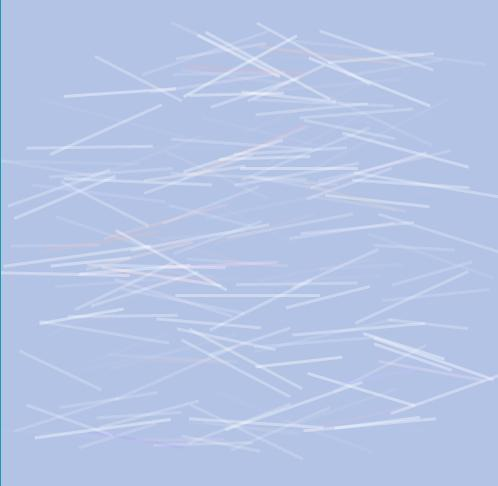

# elmlive Sketch API

## Following along elmlive @avh4 Sketch API

[youtube](https://www.youtube.com/watch?v=202uclkgIdc)

Today we try to reproduce a Processing sketch and create an Elm API for easily making graphical sketches in Elm.

Original code is at [github](https://github.com/avh4-experimental/elm-graphics/tree/ElmLive-2016-10-30)

## commands

- `elm-package install Kwarrtz/render` for the SVG render package
- `npm run elm-live` to start the server ( or `` `./node_modules/.bin/elm-live src/Main.elm --open`` )

## Continue from here: <https://youtu.be/kx2pydIQztE?t=763>
